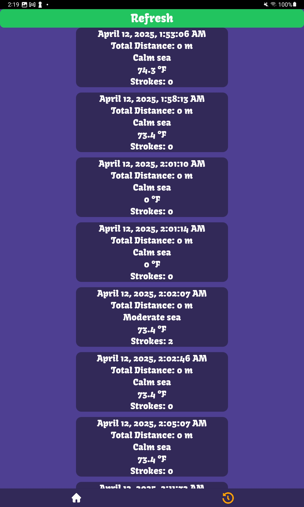
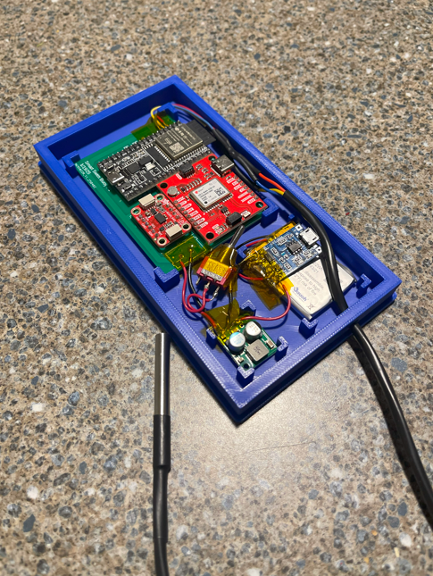

Smart Swim Buoy Mobile App

📖 Project Overview

This project is a smart swim buoy system paired with a mobile application. The buoy is designed to track swimming workouts by recording GPS position, estimating sea state, and measuring water temperature, along with optional data such as stroke count. It helps swimmers monitor workout progress and provides turn-back alerts once the target distance is reached.

Data is recorded at one-second intervals and transmitted to the mobile app via Bluetooth or Wi-Fi. The buoy hardware is powered by a custom circuit board with integrated RF components, accelerometer modules, GPS, temperature sensors, and a rechargeable battery.

The companion mobile app provides an intuitive interface for viewing swim progress, managing workout history, and handling user authentication.

⚙️ Tech Stack

Frontend: React Native CLI + Tailwind CSS

Backend: Node.js + Express.js

Database: MongoDB (user data, workout history)

Deployment: Local via Ngrok for backend development

Communication: Bluetooth Classic & Wi-Fi

Math/Algorithms: Haversine formula for distance calculations

📱 Mobile App Features

User Authentication – Sign up and login with MongoDB-backed accounts

Workout Tracking – GPS-based position tracking with distance calculations

Progress Indicator – Notifies swimmers when workout goals are met

Workout History – Stores past swim sessions for review

Bluetooth/Wi-Fi Sync – Transfers buoy data to the mobile app in real-time

  
  
  
  
  
  
  
  
  
  

